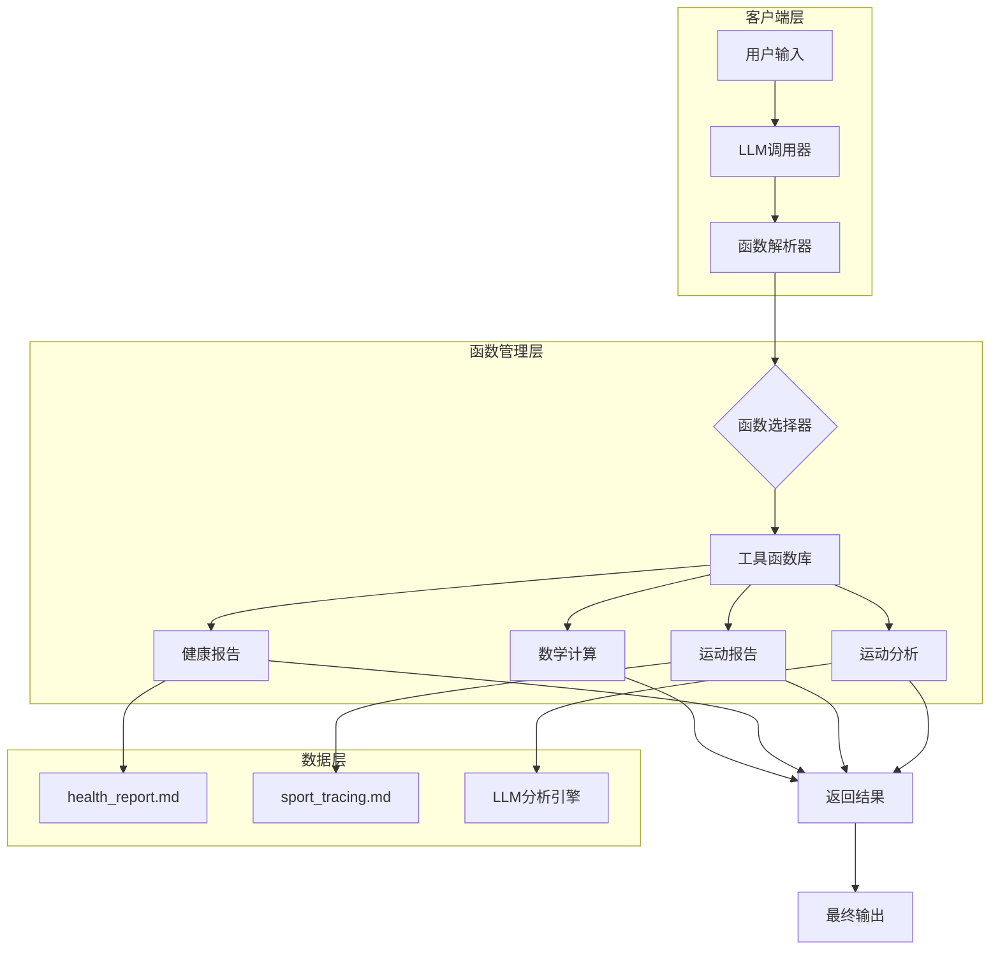
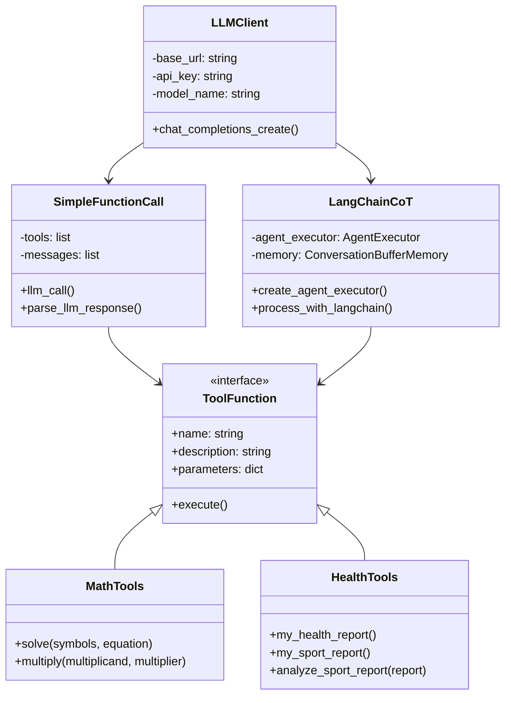
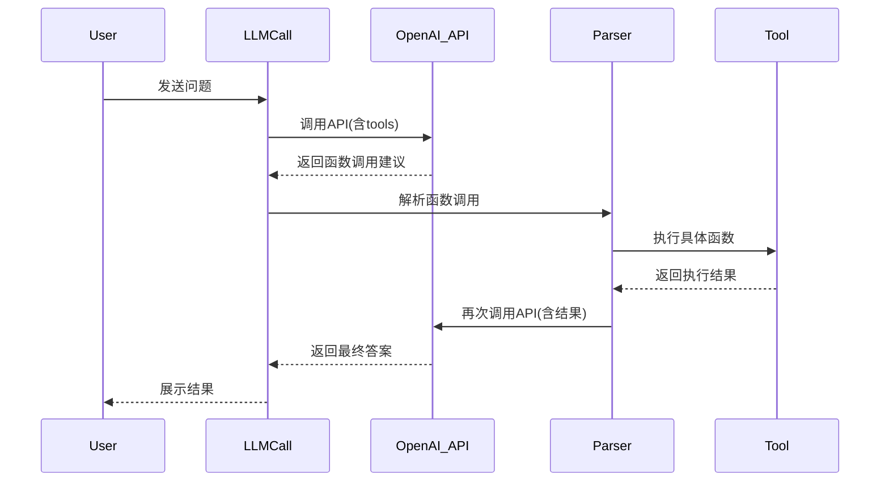
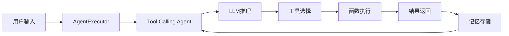
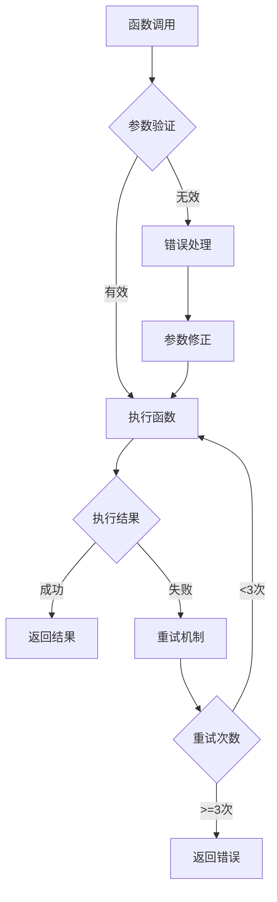

# LLM Function Calling 技术方案文档

## 项目概述

本文档详细阐述了基于OpenAI API的LLM Function Calling技术实现方案，包含两种实现模式：简单函数调用(Simple Function Call)和LangChain思维链(CoT)函数调用。项目通过定义标准工具函数接口，实现LLM与外部工具的动态交互。

## 技术架构

### 系统架构图



### 核心组件架构



## 实现方案详解

### 方案一：简单函数调用实现

#### 1.1 工具定义规范

```python
# 工具定义标准格式
tools = [
    {
        "type": "function",
        "function": {
            "name": "solve",
            "description": "求解方程",
            "parameters": {
                "type": "object",
                "properties": {
                    "symbols": {"type": "string", "description": "符号"},
                    "equation": {"type": "string", "description": "方程"}
                },
                "required": ["symbols", "equation"]
            }
        }
    }
]
```

#### 1.2 调用流程时序图



#### 1.3 核心代码实现

```python
def parse_llm_response(model_response, messages):
    """
    解析LLM响应并处理函数调用
    关键特性：
    1. 递归处理直到无函数调用
    2. 参数验证和错误处理
    3. 结果传递和上下文维护
    """
    
    while model_response.choices[0].message.tool_calls:
        tool_call = model_response.choices[0].message.tool_calls[0]
        args = tool_call.function.arguments
        
        # 函数路由分发
        if tool_call.function.name == "solve":
            function_result = solve(**json.loads(args))
        elif tool_call.function.name == "multiply":
            function_result = multiply(**json.loads(args))
        elif tool_call.function.name == "analyze_sport_report":
            # 参数验证和错误处理
            try:
                args_dict = json.loads(args)
                report = args_dict.get('report')
                if report is None:
                    report = my_sport_report()  # 备用方案
                function_result = analyze_sport_report(report)
            except Exception as e:
                function_result = {"error": str(e)}
        
        # 构建工具调用消息
        messages.append({
            "role": "tool",
            "content": json.dumps(function_result),
            "tool_call_id": tool_call.id
        })
        
        # 继续下一轮调用
        model_response = client.chat.completions.create(
            model=model_name,
            messages=messages,
            tools=tools
        )
    
    return model_response.choices[0].message.content
```

### 方案二：LangChain思维链(CoT)实现

#### 2.1 架构设计



#### 2.2 Agent配置详解

```python
def create_agent_executor() -> AgentExecutor:
    """
    创建LangChain Agent执行器
    核心配置：
    1. 强制工具调用策略
    2. 对话记忆管理
    3. 错误处理和重试机制
    """
    
    # LLM配置
    llm = ChatOpenAI(
        base_url="http://localhost:11434/v1",
        api_key="ollama",
        model=model_name,
        temperature=0.1  # 降低随机性，确保一致性
    )
    
    # 工具定义
    tools = create_langchain_tools()
    
    # 强化提示模板
    prompt = ChatPromptTemplate.from_messages([
        ("system", 
         "你是一个**必须严格遵守指令**的智能助手。\n"
         "当用户要求分析运动报告时，必须严格按照以下步骤执行：\n"
         "步骤1：立即调用my_sport_report获取报告\n"
         "步骤2：将完整报告传递给analyze_sport_report\n"
         "步骤3：返回分析结果作为最终答案\n"
         "**重要**：必须调用analyze_sport_report，否则任务未完成"),
        ("user", "{input}"),
        MessagesPlaceholder(variable_name="agent_scratchpad")
    ])
    
    # Agent创建
    agent = create_tool_calling_agent(llm=llm, tools=tools, prompt=prompt)
    
    # 执行器配置
    return AgentExecutor.from_agent_and_tools(
        agent=agent,
        tools=tools,
        memory=ConversationBufferMemory(),
        verbose=True,
        max_iterations=10,
        handle_parsing_errors=True,
        return_intermediate_steps=True
    )
```

#### 2.3 执行流程监控

```python
def process_with_langchain(message: str) -> str:
    """
    LangChain处理流程
    监控点：
    1. 工具调用顺序
    2. 参数传递正确性
    3. 异常处理机制
    4. 手动兜底策略
    """
    
    agent_executor = create_agent_executor()
    
    try:
        result = agent_executor.invoke({"input": message})
        
        # 工具调用验证
        analyze_called = False
        final_analysis = ""
        
        # 分析中间步骤
        if "intermediate_steps" in result:
            for step in result["intermediate_steps"]:
                if step[0].tool == "analyze_sport_report":
                    analyze_called = True
        
        # 手动兜底机制
        if not analyze_called:
            sport_report = None
            for step in result["intermediate_steps"]:
                if step[0].tool == "my_sport_report":
                    sport_report = step[1]
                    break
            
            if sport_report:
                final_analysis = analyze_sport_report(sport_report)
                result["output"] = final_analysis
        
        return result["output"]
        
    except Exception as e:
        return f"处理请求时出错: {str(e)}"
```

## 工具函数详细设计

### 数学计算工具

#### 方程求解器

```python
def solve(symbols: str, equation: str) -> dict:
    """
    使用SymPy求解数学方程
    
    Args:
        symbols: 变量符号定义
        equation: 方程字符串，格式如 "x**2 - 4 = 0"
    
    Returns:
        dict: 包含符号、方程和解的字典
        
    Example:
        >>> solve("x", "x**2 - 4 = 0")
        {'symbols': 'x', 'equation': 'x**2 - 4 = 0', 'solutions': '[-2, 2]'}
    """
    x = sp.symbols('x')
    _equation = sp.sympify(equation.split('=')[0])
    _equation = sp.Eq(_equation, 0)
    solutions = sp.solve(_equation, x)
    
    return {
        "symbols": symbols,
        "equation": equation,
        "solutions": str(solutions)
    }
```

#### 大数乘法器

```python
def multiply(multiplicand: float, multiplier: float) -> dict:
    """
    高精度大数乘法计算
    
    Args:
        multiplicand: 被乘数
        multiplier: 乘数
    
    Returns:
        dict: 包含计算结果的字典
    """
    result = multiplicand * multiplier
    return {"value": result}
```

### 健康数据工具

#### 健康报告获取

```python
def my_health_report() -> str:
    """
    从本地文件读取健康报告
    
    数据格式:
    - 文件: health_report.md
    - 内容: Markdown格式的健康数据
    
    Returns:
        str: 完整的健康报告文本
    """
    try:
        with open("health_report.md", "r", encoding="utf-8") as f:
            report = f.read()
        return report
    except FileNotFoundError:
        return "健康报告文件不存在"
    except Exception as e:
        return f"读取健康报告失败: {str(e)}"
```

#### 运动报告分析

```python
def analyze_sport_report(report: str) -> str:
    """
    使用LLM进行运动报告智能分析
    
    分析维度:
    1. 运动类型和频率分析
    2. 运动强度评估
    3. 健康趋势识别
    4. 个性化建议生成
    
    Args:
        report: 原始运动报告文本
    
    Returns:
        str: AI生成的分析报告
    """
    
    messages = [
        {"role": "system", "content": "你是一个专业的运动医学专家..."},
        {"role": "user", "content": f"""
        请按照以下步骤分析运动报告：
        1. 理解运动类型、时长、频率
        2. 分析关键指标（运动频率、强度）
        3. 评估计划合理性
        4. 给出针对性建议
        5. 绘制运动趋势图表
        6. 总结运动效果
        
        运动报告：{report}
        """}
    ]
    
    response = client.chat.completions.create(
        model=model_name,
        messages=messages,
        temperature=0.9
    )
    
    return response.choices[0].message.content
```

## 错误处理和监控

### 异常处理机制



### 日志和监控

```python
import logging
from colorama import Fore, Style

# 配置彩色日志
logging.basicConfig(
    level=logging.INFO,
    format=f'{Fore.GREEN}%(asctime)s{Style.RESET_ALL} - '
           f'{Fore.YELLOW}%(levelname)s{Style.RESET_ALL} - '
           f'{Fore.WHITE}%(message)s{Style.RESET_ALL}'
)

def log_function_call(func_name, params, result):
    """记录函数调用日志"""
    logging.info(f"🔄 调用函数: {func_name}")
    logging.debug(f"📥 参数: {params}")
    logging.info(f"📤 结果: {str(result)[:100]}...")
```

## 性能优化建议

### 1. 缓存机制

```python
from functools import lru_cache

@lru_cache(maxsize=128)
def cached_sport_report():
    """缓存运动报告，避免重复读取文件"""
    return my_sport_report()
```

### 2. 并发处理

```python
import asyncio
from concurrent.futures import ThreadPoolExecutor

async def batch_analyze_reports(reports):
    """批量分析多个运动报告"""
    with ThreadPoolExecutor(max_workers=4) as executor:
        futures = [executor.submit(analyze_sport_report, report) 
                  for report in reports]
        return [f.result() for f in futures]
```

### 3. 连接池优化

```python
from openai import AsyncOpenAI

# 使用异步客户端提升性能
async_client = AsyncOpenAI(
    base_url="http://localhost:11434/v1",
    api_key="ollama"
)
```

## 测试用例

### 单元测试示例

```python
import pytest

def test_solve_equation():
    """测试方程求解"""
    result = solve("x", "x**2 - 4 = 0")
    assert result["solutions"] == "[-2, 2]"

def test_multiply_large_numbers():
    """测试大数乘法"""
    result = multiply(123456789, 987654321)
    assert result["value"] == 123456789 * 987654321

def test_health_report_exists():
    """测试健康报告文件存在"""
    report = my_health_report()
    assert isinstance(report, str)
    assert len(report) > 0
```

## 部署和运维

### 环境配置

```yaml
# docker-compose.yml
version: '3.8'
services:
  ollama:
    image: ollama/ollama:latest
    ports:
      - "11434:11434"
    volumes:
      - ./models:/root/.ollama
      - ./data:/app/data
  
  llm-app:
    build: .
    depends_on:
      - ollama
    environment:
      - OPENAI_BASE_URL=http://ollama:11434/v1
      - MODEL_NAME=qwen2
```

### 监控指标

- 函数调用成功率
- 平均响应时间
- 错误率统计
- 资源使用监控

## 总结

本技术方案通过两种实现模式展示了LLM Function Calling的完整生命周期：

1. **简单模式**：轻量级、直接调用，适合简单场景
2. **LangChain模式**：企业级、可扩展，支持复杂业务流程

两种方案都具备：
- 完整的错误处理机制
- 详细的日志监控
- 可扩展的工具体系
- 高性能的并发支持

可根据实际业务需求选择合适的实现方案。